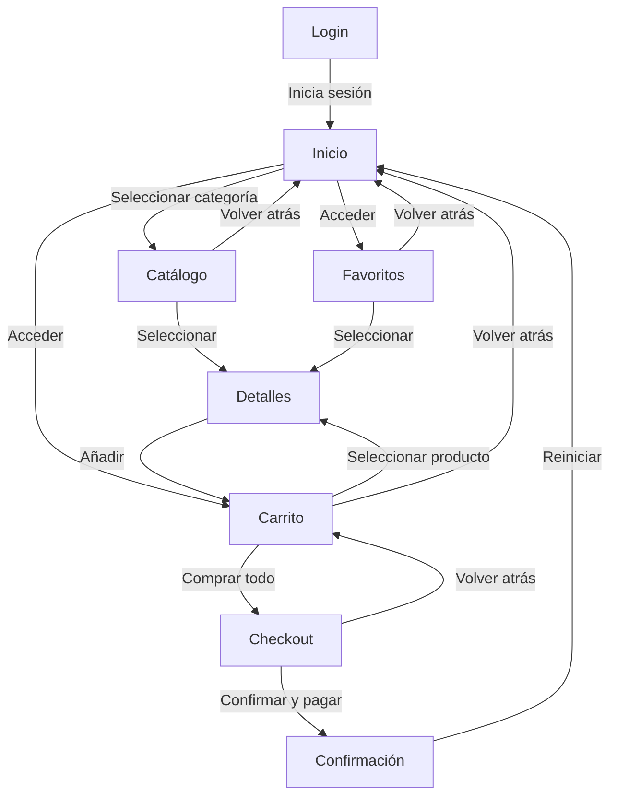
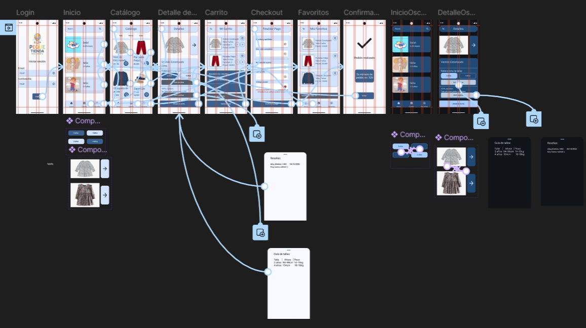
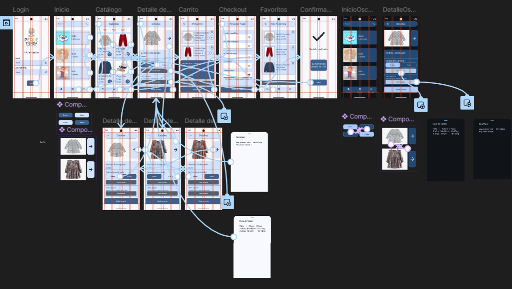

# Documentación de la interfaz - Pequetienda

## 1. Justificación del diseño
### 1.1 Importancia del diseño centrado en el usuario
El diseño centrado en el usuario es importante ya que cuando el programa esta pensado en las necesidades especificas del usuario, este aumenta su satisfacción ya que pueden utilizar una aplicación en la que encuentran los que buscan facilmente, lo que hará que el usuario tienda a volver a utilizar la aplicación en una futura ocasión, mejorando la retención. Otra cuestión por la que el diseño centrado en el usuario es importante es que  este nos ayuda a identificar y corregir problemas antes de que afecten a un gran número de usuarios, lo que puede ayudar a evitar el riesgo de fracaso del producto.
### 1.2 Objetivos y metas del proyecto
* Posibilidad de realizar una compra en menos de un minuto y medio
* Aumentar la claridad visual
* Facilitar la navegación mediante menus sencillos y descriptivos
### 1.3 Beneficios esperados
__Para el usuario:__ Una aplicación facil de usar y eficaz en la que hacer sus compras de manera sencilla.  
__Para el negocio:__ Mejorar la retención de usuarios, ya que estos se sentirán satisfechos con un diseño de interfaz sencillo de usar.

## 2. Investigación y análisis de usuarios
### 2.1 Datos demográficos y segmentación
El público principal al que va dirigido esta aplicación es a madres, padres, abuelos y personas que compran regalos a sus niños, pero que carecen de tiempo suficiente, compran desde el movil y tienen bastantes dudas con las tallas.
### 2.2 Personas (Nombre, edad, contexto, objetivo, frustración)                            (#### Persona 1: … y #### Persona 2: …)
* __Persona 1:__ Noelia, 38 años, A punto de traer al mundo a su primer hijo, Comprar las primeras prendas de su futuro hijo, Está muy confusa con respecto a la ropa que debe comprar.
* __Persona 2:__ Paco, 77 años, Tiene 2 nietos cuyos cumples están a la vuelta de la esquina, Comprar ropa como regalo para sus nietos, No está muy familiarizado con las tecnologías y la compra online por lo que le resulta muy complicado y confuso y no quiere equivocarse con las tallas.
### 2.3 Análisis de la competencia           (tabla con mín. 3 apps)
| Aplicación | Qué hacen bien | Qué hacen mal | Qué me llevo |
| :--- | :--- | :--- | :--- |
| **PatPat** | - **Permitir reseñas:** Los usuarios tienen la posibilidad de revisar reseñas reales con fotos de otros padres y valoraciones por rangos de edad muy visibles. - **Variedad y filtros:** Gran variedad de productos filtrados por temáticas. | - **Sobrecarga visual** La interfaz suele abusar de pop-ups, banners agresivos de cuenta atrás y estímulos que generan gran fatiga visual al usuario. - **Tiempos de envío erróneos:** Los tiempos prometidos en la aplicación a menudo no coinciden con la realidad del envío. - **Inconsistencia en las tallas:** Al agrupar fabricantes de terceros, las medidas varían drásticamente provocando confusión y errores. | **Importancia de las reseñas:** Los padres confían más en las fotos y opiniones de otros padres que en las del propio catálogo, por lo que es un elemento vital para nuestra aplicación. |
| **Gocco** | - **Especialización por etapas de crecimiento:** Se divide de forma muy intuiitiva el catálogo por etapas (Primera puesta, Bebé, Niño/Niña) - **Estética de marca limpia:** Dirección de arte elegante y fotografía de estudio muy cuidada que refuerza su posicionamiento de gama media-alta. | - **Fallos técnicos de stock:** Problemas ocasionales de stock fantasma que indican disponibilidad que luego falla al seleccionar talla.  - **Inestabilidad:** La app móvil puede volverse lenta, quedarse colgada o incluso experimentar cierres en medio de una navegación. | **Coherencia entre estética y rendimiento:** En nuestra aplicación se debe cuidar que la estabilidad y rendimiento esté a la altura de la estética, ya que un pequeño bug de scroll o stock puede destruir la confianza del padre inmediatamente |
| **Boboli** | - **Estructura clara:** Las categorías estan estructuradas por edad, género, tipo de prenda y colecciones coordinadas. - **Fichas de producto descriptivas:** Muestran con todo detalle la composición de los tejidos, lo cual es muy importante en ropa de niños por alergias, piel atópica o necesidades de lavado. | - **Experiencia de usuario móvil obsoleta:** Su interfaz a menudo se siente más como una páginaweb adaptada que como una app nativa fluida, lo que perjudica a la experiencia de usuario. | **La importancia de incluir detalles técnicos técnico:** Los padres compran con el tacto en mente para evitar molestias o alergias en sus hijos. Detallar texturas, tipos de algodón y facilidad de lavado reduce drásticamente la tasa de carritos abandonados. |
### 2.4 Insights y hallazgos clave           (mín. 4, cada uno con su decisión de diseño)
* __Dudas con las tallas:__ Incorporación de una guía de tallas basada en estatura y peso en lugar de solo la edad que sea visible en los detalles del producto.
* __Necesidad de acotar rápidamente catálogos masivos:__ Implementar una barra de filtrado en la pantalla de Catálogo que permitan filtrar por talla, color y precio, manteniendo la interfaz limpia y organizada.
* __Errores al rellenar el pago:__ En la pantalla de Checkout, usar campos de texto que marquen en rojo el error y muestren un mensaje de ayuda claro si el dato es incorrecto.
* __Borrar sin querer un producto del carrito:__ Mostrar un aviso flotante con un botón de Deshacer cada vez que se borre un artículo para poder recuperarlo al instante.

## 3. Diseño de la interfaz
### 3.1 Mapa de navegación

### 3.2 Wireframes
#### Login

#### Inicio

#### Catálogo

#### Detalle de producto

#### Carrito

#### Checkout

#### Confirmación

#### Favoritos

### 3.3 Guía de estilo Material Design 3
#### Estilo Claro
| Pareja de Tokens M3 | Color/OnColor | Ratio de Contraste | Cumplimiento WCAG AA |
| :--- | :--- | :--- | :--- |
| **Primary / On Primary** | #32618D / #FFFFFF | **5.4 : 1** | Sí |
| **Secondary / On Secondary** | #526070 / #FFFFFF | **6.1 : 1** | Sí |
| **Tertiary / On Tertiary** | #695779 / #FFFFFF | **6.3 : 1** | Sí |
| **Surface / On Surface** | #F8F9FF / #191C20 | **14.2 : 1** | Sí |
| **Error / On Error** | #BA1A1A / #FFFFFF | **5.9 : 1** | Sí |  

#### Estilo Oscuro
| Pareja de Tokens M3 | Color/OnColor | Ratio de Contraste | Cumplimiento WCAG AA |
| :--- | :--- | :--- | :--- |
| **Primary / On Primary** | #9ECAFC / #003355 | **7.8 : 1** | Sí |
| **Secondary / On Secondary** | #BAC8DA / #243240 | **8.0 : 1** | Sí |
| **Tertiary / On Tertiary** | #D5BEE5 / #3A2A48 | **7.9 : 1** | Sí |
| **Surface / On Surface** | #101418 / #E0E2E8 | **13.5 : 1** | Sí |
| **Error / On Error** | #FFB4AB / #690005 | **8.2 : 1** | Sí |
### 3.4 Prototipo de alta fidelidad
#### Login

#### Inicio

#### Catálogo

#### Detalle de producto

#### Carrito

#### Checkout

#### Confirmación

#### Favoritos

#### Inicio en Modo Oscuro

#### Detalle de producto en modo oscuro

## 4. Validación y pruebas
### 4.1 Metodología
Las tareas que he encargado a los usuarios testeadores son las siguientes:
* __Tarea 1:__ Comprar Vestido Estampado colores claros talla 3 años.
* __Tarea 2:__ Comprar Vestido Estampado colores oscuros talla 4 años.
* __Tarea 3:__ Comprar Vestido Estampado colores claros talla 4 años.
### 4.2 Resultados                           (tabla con mín. 2 participantes)
| Usuario | Tarea | Éxito | Tiempo | Errores |
| --- | --- | --- | --- | --- |
| Paula | Tarea 1 | Éxito | 10 segundos | "Hubiera tardado menos si me hubiera dado cuenta de la guía de tallas" |
| Paula | Tarea 2 | Fracaso | 20 segundos | "No me dejaba seleccionar otra prenda que no sea el conjunto claro" |
| Paula | Tarea 3 | Fracaso | 20 segundos | "No funcionaba el botón 4 años" |
| Diego | Tarea 1 | Éxito | 14 segundos | "Ningún problema, tardé un poco al desconocer la interfaz" |
| Diego | Tarea 2 | Fracaso | 26 segundos | "No me deja cambiar el color de la prenda" |
| Diego | Tarea 3 | Fracaso | 29 segundos | "No funciona los botones de tallas |
### 4.3 Iteraciones y mejoras               (antes/después)
#### Antes

#### Después

#### Justificación
Después de que los usuarios de prueba detectasen errores a la hora de seleccionar tallas y color de la ropa en el carrusel de imagenes, he creado 3 frames adicionales de la pantalla de detalles que contengan las distintas variantes de los componentes afectados. Después de esto, al probar nuevamente, funciona correctamente 

## 5. Entrega y documentación final
### 5.1 Justificación del diseño propuesto
### 5.2 Recomendaciones y pasos a seguir

## 6. Referencias bibliográficas              (mín. 4, APA 7, exportadas desde Zotero)

Palabra del día: 29